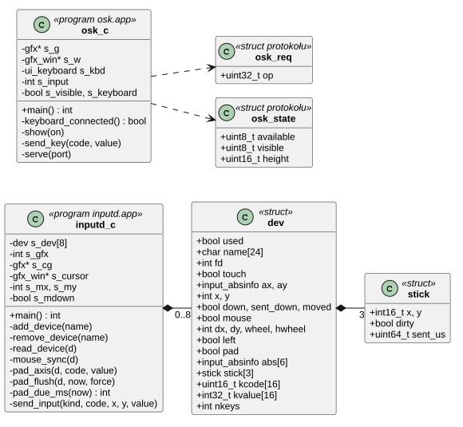
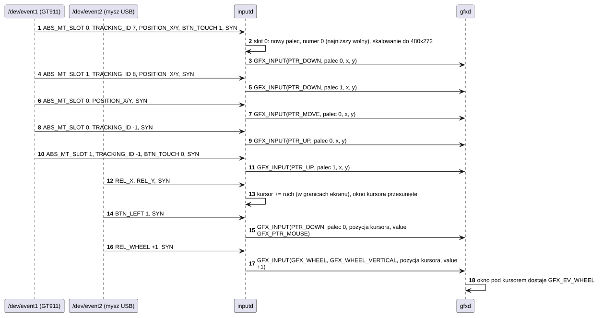
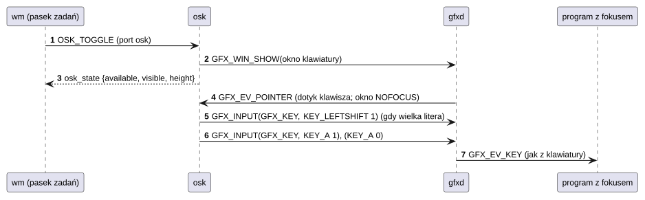
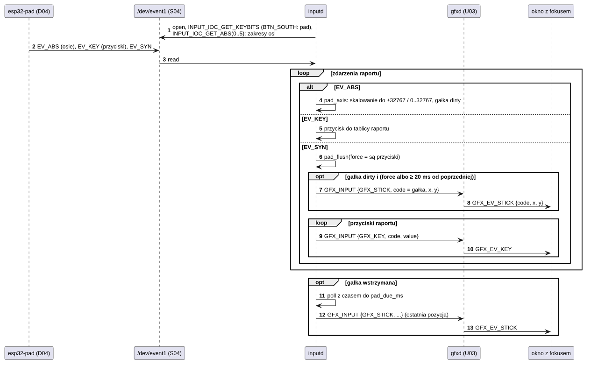

# U04 inputd i osk

## 1. Identyfikacja

| | |
|---|---|
| Identyfikator | U04 |
| Warstwa | L2 (usługi, uprawnienie `dev`) |
| Pliki | `system/services/inputd/inputd.c`, `system/services/osk/osk.c`; protokół `system/lib/libgfx/include/osk_proto.h` |
| Porty IPC | `inputd` łączy się z `devmgr` i `gfx`; `osk` udostępnia port `osk` |

## 2. Odpowiedzialność

- **inputd**: otwiera urządzenia wejścia zgłaszane przez `devmgr` (`/dev/event*`),
  zamienia dotyk (osie bezwzględne) na zdarzenia wskaźnika (naciśnięcie, ruch,
  podniesienie) we współrzędnych ekranu – na ekranie wielodotykowym osobno dla każdego
  palca, z jego numerem – przekazuje klawisze; mysz (ruch względny)
  przesuwa kursor – małe okno przepuszczające wskaźnik (`GFX_WIN_NOINPUT`) – a lewy
  przycisk działa jak palec oznaczony jako mysz (`GFX_PTR_MOUSE`), ruch bez przycisku idzie
  jako `GFX_PTR_HOVER` (podpowiedzi), kółka (pionowe i poziome)
  obracają się w miejscu kursora (`GFX_WHEEL`, do okna pod nim); pad (urządzenie z
  `BTN_SOUTH`) wysyła przyciski jako klawisze, a gałki i spusty jako `GFX_STICK`
  (przeskalowane do ±32767, spusty 0…32767, najwyżej 50 razy na sekundę na gałkę).
  Wszystko trafia do `gfxd` (`GFX_INPUT`). Urządzenia mogą się pojawiać i znikać; `gfxd`
  może się restartować.
- **osk**: klawiatura ekranowa nad paskiem zadań, gdy nie ma podłączonej klawiatury;
  nie zabiera fokusu – jej klawisze trafiają do okna z fokusem jak z prawdziwej klawiatury
  (kody Linuksa, Shift i Ctrl jako osobne klawisze). Pokazywanie i chowanie przez port
  `osk` (przycisk na pasku zadań `wm`). Rozmiar, czcionki i rogi klawiszy idą za
  ustawieniami wyglądu (skala interfejsu, L02), tak jak pasek zadań.

## 3. Wymagania

| ID | Wymaganie | Weryfikacja |
|---|---|---|
| REQ-U04-01 | Naciśnięcie, ruch i podniesienie są wysyłane w tej kolejności dla każdego dotyku (bez podniesienia bez wcześniejszego naciśnięcia). | przegląd kodu, `gfxtap`/dotyk |
| REQ-U04-02 | Współrzędne dotyku są przeskalowane z zakresu osi urządzenia do rozmiaru ekranu. | przegląd kodu |
| REQ-U04-03 | Po zniknięciu urządzenia (`-ENODEV`) jest ono zamykane; po końcu `devmgr` `inputd` kończy się, a `init` go restartuje (ponowna subskrypcja). | przegląd kodu |
| REQ-U04-04 | Klawiatura ekranowa jest niedostępna (schowana), gdy podłączone jest urządzenie z klawiszami liter (sprawdzane co 3 s). | test ręczny z klawiaturą USB |
| REQ-U04-05 | Klawisze klawiatury ekranowej nie zmieniają fokusu (okno `GFX_WIN_NOFOCUS`, `TOPMOST`). | test ręczny (`term`) |
| REQ-U04-06 | Pozycja gałki pada jest wysyłana najwyżej co 20 ms (`STICK_US`), ostatnia zawsze (po upływie tego czasu); gałki z raportu, w którym są też przyciski, idą od razu i przed przyciskami. Pad nie jest traktowany jak ekran dotykowy, choć ma osie `ABS_X`/`ABS_Y`. | przegląd kodu, `kmon evtest event1` i gra `voxel` z padem |
| REQ-U04-07 | Ekran wielodotykowy (sloty `ABS_MT_*`) daje zdarzenia wskaźnika dla każdego palca: palec ma od naciśnięcia do podniesienia numer w `code` (0…`GFX_FINGERS − 1`), najniższy wolny w chwili naciśnięcia, więc pierwszy palec na pustym ekranie to 0; szósty palec nie jest zgłaszany. W jednym raporcie najpierw idą podniesienia, potem naciśnięcia i ruchy; ruch tylko przy zmianie pozycji. Znikające urządzenie podnosi swoje palce. | przegląd kodu, dotyk dwoma palcami (ręcznie) |
| REQ-U04-08 | Zdarzenia wskaźnika myszy mają w `value` `GFX_PTR_MOUSE`; ruch myszy przy puszczonym lewym przycisku idzie jako `GFX_PTR_HOVER` (pozycja kursora), przy wciśniętym jako `GFX_PTR_MOVE`; obroty kółek z jednego raportu (`REL_WHEEL`, `REL_HWHEEL`) są sumowane i wysyłane raz jako `GFX_WHEEL` (`code` oś, `value` ząbki) w pozycji kursora, po zdarzeniach przycisku i ruchu. | przegląd kodu; kółko myszy USB nad menu, listą i terminalem (ręcznie) |
| REQ-U04-09 | Po `GFX_EV_SETTINGS` klawiatura ekranowa przyjmuje wysokość dla nowej skali (`ui_keyboard_height`: od `ui_px(100)` do `ui_px(160)`) i staje tuż nad paskiem zadań nowej wysokości (`ui_px(26)`); klawisze mają czcionkę i promień rogów z motywu. Gdy nowego rozmiaru nie da się przydzielić, zostaje poprzedni. | na płytce 03.10.2026: klawiatura przy 100 i 150% (zrzuty), przegląd kodu |

## 4. Interfejs udostępniany

| Usługa | Interfejs | Opis |
|---|---|---|
| `inputd` | brak (klient `devmgr` i `gfx`) | wysyła `GFX_INPUT {kind, code, x, y, value, time_ms}`; `kind`: `GFX_PTR_*` (`code` = numer palca, mysz: 0 z `value` = `GFX_PTR_MOUSE`, ruch bez przycisku `GFX_PTR_HOVER`), `GFX_KEY`, `GFX_STICK` (`code` = `GFX_STICK_LEFT/RIGHT/TRIGGERS`, `x`/`y` pozycja), `GFX_WHEEL` (`code` = `GFX_WHEEL_VERTICAL/HORIZONTAL`, `value` ząbki, `x`/`y` kursor) |
| `osk` | port `osk`: `msg_call(struct osk_req {op})` → `struct osk_state {available, visible, height}` | `OSK_STATE`, `OSK_SHOW`, `OSK_HIDE`, `OSK_TOGGLE` |

## 5. Interfejsy wymagane

U02 (`DEVMGR_SUBSCRIBE` z przedrostkiem `event`), U03 (`GFX_INPUT`, okna), S04
(`/dev/event*`: `read`, `INPUT_IOC_GET_ABS_X/Y`, `INPUT_IOC_GET_ABS(oś)`,
`INPUT_IOC_GET_KEYBITS`), L02 (`libgfx`:
okno kursora, klawiatura `ui_keyboard`), L01.

## 6. Struktura statyczna

*Źródło: [U04/struktura-statyczna.puml](../diagramy/U04/struktura-statyczna.puml)*

## 7. Zachowanie dynamiczne

### 7.1 Dotyk i mysz

*Źródło: [U04/dotyk-i-mysz.puml](../diagramy/U04/dotyk-i-mysz.puml)*

### 7.2 Klawisz z klawiatury ekranowej

*Źródło: [U04/klawisz-z-klawiatury-ekranowej.puml](../diagramy/U04/klawisz-z-klawiatury-ekranowej.puml)*

### 7.3 Pad: gałki i przyciski

*Źródło: [U04/pad.puml](../diagramy/U04/pad.puml)*

## 8. Implementacja

- `inputd`: pętla `poll` na porcie zdarzeń `devmgr` i plikach urządzeń; urządzenie jest
  „padem”, gdy jego mapa klawiszy ma `BTN_SOUTH`, „dotykowe”, gdy nie jest padem i ma osie
  bezwzględne (`INPUT_IOC_GET_ABS_X`), „myszą”, gdy zgłasza ruch względny albo przyciski
  myszy. Połączenie z `gfxd` jest odnawiane co 500 ms, gdy go nie ma.
- Wielodotyk: urządzenie dotykowe, które zgłosiło `ABS_MT_*`, ma tablicę 10 slotów
  (identyfikator palca, pozycja, zmiana pozycji, przydzielony numer palca). `mt_event`
  zapisuje zdarzenia w bieżącym slocie (`ABS_MT_SLOT`); nowy identyfikator w zajętym slocie
  oznacza nowy palec. Przy `EV_SYN` `mt_sync` najpierw wysyła `PTR_UP` palców, których
  identyfikator to −1 (albo zmienił się), potem `PTR_DOWN` nowych (najniższy wolny numer
  z globalnej maski `s_fingers`) i `PTR_MOVE` przesuniętych. Urządzenia bez slotów dalej
  dają palec 0 z `ABS_X/ABS_Y` i `BTN_TOUCH`.
- Pad: `pad_axis` skaluje oś z jej zakresu (`INPUT_IOC_GET_ABS`, pobranego przy otwarciu)
  do ±32767 (zakres z wartościami ujemnymi) albo 0…32767 i zapisuje ją w gałce
  (`ABS_X/Y` lewa, `ABS_RX/RY` prawa, `ABS_Z/RZ` spusty); przyciski raportu czekają w
  tablicy do `EV_SYN`. Przy `EV_SYN` `pad_flush` wysyła gałki, które się ruszyły (od razu,
  jeśli raport ma przyciski, inaczej nie wcześniej niż 20 ms po poprzedniej), potem
  przyciski. Wstrzymane gałki wysyła pętla główna: czas oczekiwania `poll` to czas do
  najbliższej zaległej (`pad_due_ms`). Limit chroni kolejki zdarzeń programów (32
  komunikaty portu, K10) przed zapełnieniem ruchem gałek, który wyparłby klawisze.
- Mysz: `mouse_sync` przy `EV_SYN` przesuwa kursor, wysyła naciśnięcie, ruch albo
  podniesienie lewego przycisku (z `GFX_PTR_MOUSE`; ruch bez przycisku jako `GFX_PTR_HOVER`,
  jeden na raport, a `gfxd` przekazuje go tylko oknom z `GFX_WIN_HOVER`), potem sumy
  `REL_WHEEL`/`REL_HWHEEL`
  raportu jako `GFX_WHEEL`. Dawniej kółko dawało strzałki do okna z fokusem.
- `osk`: okno `TOPMOST | NOFOCUS` z klawiaturą `ui_keyboard` (L02), układ US; co 3 s
  sprawdza mapy klawiszy urządzeń (`INPUT_IOC_GET_KEYBITS`). `BAR_H` i `CORNER_W` (klawisz
  chowania, z wygładzonymi rogami) liczone przez `ui_px`; `restyle()` przy `GFX_EV_SETTINGS`
  zmienia rozmiar okna, przesuwa je nad pasek i przerysowuje.

## 9. Obsługa błędów i mechanizmy bezpieczeństwa

| Sytuacja | Reakcja |
|---|---|
| brak `devmgr` (10 s) | `inputd` kończy się (init restartuje) |
| `gfxd` niedostępny | ponowne łączenie co 500 ms, zdarzenia do tego czasu giną |
| urządzenie usunięte | zamknięcie pliku |
| podłączona klawiatura | `osk` chowa się, `available = 0` |

## 10. Konfiguracja

`MAX_DEV` (8), `MT_SLOTS` (10), `STICK_US` (20000) w `inputd.c`; `GFX_FINGERS` (5) w
`gfx_proto.h`; `BAR_H` (26 przy 100%), `CORNER_W` (48 przy 100%), `SCAN_MS` (3000),
`MAX_INPUTS` (16) w `osk.c`.

## 11. Weryfikacja

- Dotyk na ekranie, SW8, mysz i klawiatura USB (tryb host) – testy ręczne.
- `crtos run gfxtap` omija `inputd` i sprawdza resztę ścieżki (`gfxtap stick N X Y [MS]`:
  gałka pada, `gfxtap hold X0 Y0 X1 Y1 [MS]`: dwa palce naraz, `gfxtap wheel X Y N`: kółko,
  `gfxtap mdrag`, `mclick`: mysz).
- 30.09.2026: odbiornik Logitech (046d:c534) na J10 – mysz w protokole raportów, kursor
  się porusza (odczyt X/Y z deskryptora).
- Pad: `crtos kmon "evtest event1 3"` (osie i przyciski sterownika), gra `voxel` (chodzenie
  i rozglądanie się gałkami) – z padem, ręcznie.
- 03.10.2026: klawiatura ekranowa przy skali 100 i 150% (`appearance scale …`, zrzuty).

## 12. Ograniczenia i znane problemy

- Wielodotyk to osobne palce; `inputd` nie rozpoznaje gestów (szczypanie, przewijanie
  dwoma palcami).
- Klawiatura ekranowa ma tylko układ US; przy 175–200% na ekranie 480×272 zajmuje ponad
  połowę obszaru nad paskiem zadań.
- Prawy i środkowy przycisk myszy nie są przekazywane.
