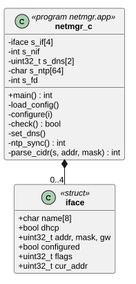
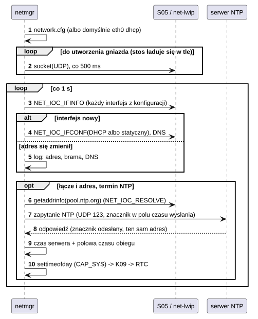

# U05 netmgr

## 1. Identyfikacja

| | |
|---|---|
| Identyfikator | U05 |
| Warstwa | L2 (usługa, uprawnienie `sys`) |
| Pliki | `system/services/netmgr/netmgr.c`; konfiguracja `rootfs/etc/network.cfg` → `/sd/crtos/etc/network.cfg` |

## 2. Odpowiedzialność

- Konfiguracja interfejsów sieciowych z `network.cfg` (DHCP albo adres statyczny z bramą),
  także interfejsów, które pojawią się później (moduły ładują się w tle).
- Stałe serwery DNS (zamiast tych z DHCP).
- Zegar z NTP (RFC 5905, tryb klienta): pierwsza synchronizacja, gdy któryś interfejs ma
  adres i łącze, potem co godzinę; ustawienie zegara wymaga `CAP_SYS` i trafia do RTC
  (D08).
- Log zmian stanu (adres, brama, DNS, brak łącza).

## 3. Wymagania

| ID | Wymaganie | Weryfikacja |
|---|---|---|
| REQ-U05-01 | Bez pliku konfiguracji: `eth0` z DHCP i czas z `pool.ntp.org`. | przegląd kodu |
| REQ-U05-02 | Interfejs pojawiający się po starcie usługi jest skonfigurowany w ciągu ok. 1 s. | log startu (`netmgr: eth0: asking DHCP`) |
| REQ-U05-03 | Zegar jest ustawiany z NTP dopiero, gdy interfejs ma adres i łącze. | log `clock set by netmgr` |

## 4. Interfejs udostępniany

Format `network.cfg`:

```
iface <nazwa> dhcp
iface <nazwa> static <adres>/<bity> [gw <adres>]
dns <serwer> [<serwer>]
ntp <serwer> | off
```

Usługa nie ma portu IPC; stan interfejsów podają `ifconfig` (A03) i `NET_IOC_IFINFO`.

## 5. Interfejsy wymagane

S05 (gniazdo UDP: `NET_IOC_IFINFO`, `NET_IOC_IFCONF`, `NET_IOC_DNS_GET/SET`;
`getaddrinfo` przez `NET_IOC_RESOLVE`; `sendto`/`recvfrom` do serwera NTP), K09
(`settimeofday` → ustawienie zegara), L01.

## 6. Struktura statyczna



*Źródło: [U05/struktura-statyczna.puml](../diagramy/U05/struktura-statyczna.puml)*

## 7. Zachowanie dynamiczne



*Źródło: [U05/konfiguracja-i-ntp.puml](../diagramy/U05/konfiguracja-i-ntp.puml)*

## 8. Implementacja

- Jeden wątek, pętla co 1 s: `check()` konfiguruje interfejsy, które się pojawiły,
  i loguje zmiany; zwraca, czy któryś ma adres i łącze.
- NTP: do 3 zapytań z limitem 2 s; odpowiedź jest przyjmowana tylko z adresu serwera,
  w wersji 4 i trybie serwera, z niezerowym stratum i z odesłanym znacznikiem (losowa
  wartość wpisana w pole czasu wysłania zapytania). Czas = czas wysłania z serwera (1900 →
  1970) + połowa czasu obiegu.
- Następna synchronizacja: po 1 h (udana), po 24 h (zegara nie wolno ustawić), po 30 s
  (brak odpowiedzi).

## 9. Obsługa błędów i mechanizmy bezpieczeństwa

| Sytuacja | Reakcja |
|---|---|
| stos TCP/IP jeszcze nie działa | czekanie co 500 ms (log jeden raz) |
| niezrozumiała linia `network.cfg` | log z numerem linii, linia pominięta |
| interfejsu jeszcze nie ma | pominięty, sprawdzany co 1 s |
| błąd `NET_IOC_IFCONF` | log, ponowna próba przy kolejnym przeglądzie |
| NTP nie odpowiada / nazwa nieznana | log, ponowienie po 30 s |
| brak prawa do ustawienia zegara | log, ponowienie po 24 h |

## 10. Konfiguracja

`MAX_IF` (4), `NTP_EVERY_S` (3600), `NTP_RETRY_S` (30); plik `network.cfg`.

## 11. Weryfikacja

- Log startu: DHCP w ok. 1 s po łączu, `clock set by netmgr`; `crtos run ifconfig`.

## 12. Ograniczenia i znane problemy

- Brak uwierzytelnienia NTP (czas można podrobić w sieci lokalnej).
- Brak IPv6, brak wielu adresów na interfejs.
