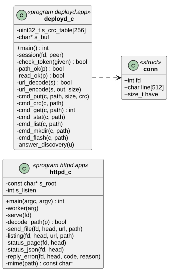
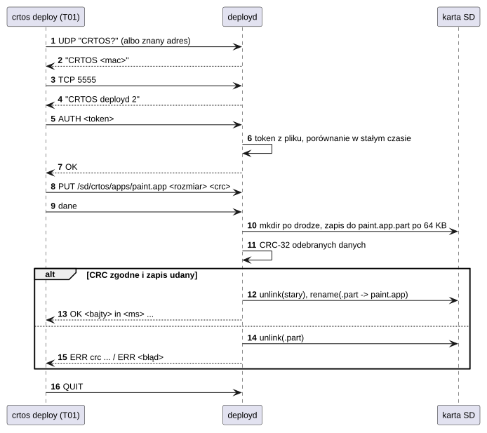
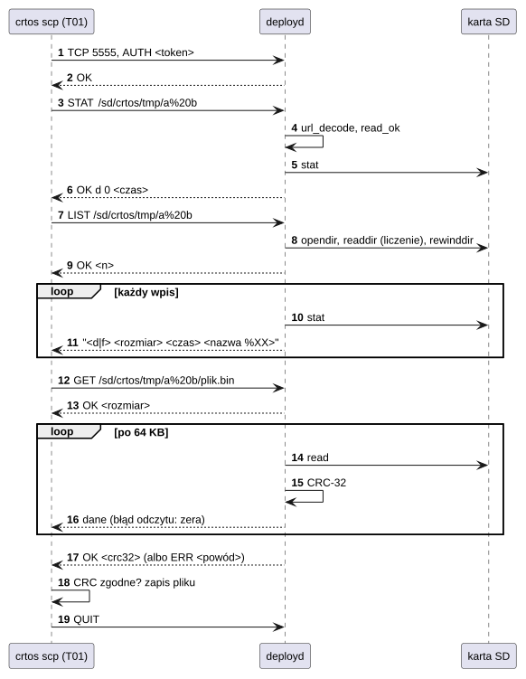

# U06 httpd i deployd

## 1. Identyfikacja

| | |
|---|---|
| Identyfikator | U06 |
| Warstwa | L2 (usługi) |
| Pliki | `system/services/httpd/httpd.c` (bez uprawnień), `system/services/deployd/deployd.c` (uprawnienia `sys`, `dev`) |
| Porty sieciowe | `httpd`: TCP 80; `deployd`: TCP 5555 i UDP 5555 (wykrywanie) |

## 2. Odpowiedzialność

- **httpd**: mały serwer WWW (GET, HEAD; odpowiedzi HTTP/1.1 z „Connection: close”): pliki
  z `/sd/crtos/www`, listing katalogów, `/status` (strona) i `/api/status` (JSON:
  czas pracy, CPU, pamięć, procesy, sieć); bez katalogu `www` strona `/` pokazuje stan
  systemu; kilka wątków roboczych.
- **deployd** (narzędzie deweloperskie): wgrywanie plików z komputera przez sieć (`crtos
  deploy`, `crtos scp`), pobieranie plików i list katalogów na komputer (`crtos scp
  board:...`), sumy CRC plików na płytce, zapis jądra do flash (`crtos flash --net`), restart;
  wykrywanie płytek w sieci (UDP `CRTOS?`). Chroniony tokenem.

## 3. Wymagania

| ID | Wymaganie | Weryfikacja |
|---|---|---|
| REQ-U06-01 | `httpd` udostępnia tylko pliki pod katalogiem głównym (domyślnie `/sd/crtos/www`): ścieżki bez `/` na początku, z `/..`, `\` albo `%00` są odrzucane (400). | przegląd kodu |
| REQ-U06-02 | `deployd` nie wykonuje żadnego polecenia przed poprawnym `AUTH` (token z `/sd/crtos/etc/deploy.token`, min. 16 znaków, porównanie w czasie niezależnym od miejsca różnicy, 1 s kary i rozłączenie za zły token); inne polecenie przed `AUTH` kończy sesję. | przegląd kodu |
| REQ-U06-03 | `deployd` zapisuje (`PUT`, `MKDIR`, `FLASH`, `CRC`) tylko ścieżki zaczynające się od `/sd/crtos/`, `/flash0/` (system plików flash, D10) albo `/ram/`, a czyta (`GET`, `STAT`, `LIST`) tylko `/sd`, `/flash0` i `/ram` z podkatalogami; zawsze bez `/..`, `//`, `\`, krótsze niż 200 znaków (zapis: nie kończące się `/`). Ścieżka przychodzi zakodowana `%XX` (spacje), a błędny kod albo bajt 0 odrzuca ją w całości. | przegląd kodu, `crtos deploy` pliku z `build/flash0`, `crtos scp` do `/sd/snes` i `/sd/crtos/../x` (odmowa), z `/dev/console` (odmowa) |
| REQ-U06-04 | Plik trafia na miejsce dopiero po odebraniu całości do `<ścieżka>.part` i zgodności CRC-32; przy błędzie plik docelowy się nie zmienia. Wyjątek: na `/flash0` stara wersja jest usuwana przed zapisem (REQ-U06-06), więc błąd zostawia brak pliku. | `crtos deploy` (każdy plik) |
| REQ-U06-06 | Na `/flash0` `PUT` najpierw usuwa starą wersję pliku (działający z niej program zachowuje kod do końca, D10), a nowy plik zgłasza systemowi plików swój rozmiar (`FLASHFS_IOC_RESERVE`) przed danymi; brak mieszczącego ciągu bloków kończy się `ERR No space left on device` (dane odebrane i odrzucone). | `crtos toolchain install` (`cc1` i `cc1plus` po 15–16 MB, ponowne wysłanie `cc1` na miejsce starego) |
| REQ-U06-05 | `FLASH` przekazuje obraz do `MTD_IOC_KERNEL_UPDATE` (D07), który sam go sprawdza; odmowa wraca jako `ERR`. | `crtos flash --net` (27.09.2026, także zły obraz) |
| REQ-U06-07 | `GET` wysyła najpierw rozmiar, potem dokładnie tyle bajtów (błąd odczytu dopełnia zerami, żeby strumień poleceń się nie rozjechał) i na końcu CRC-32 danych albo `ERR`; klient odrzuca plik o innym CRC. | `crtos scp -r` katalogu z plikiem 300 KB i nazwami ze spacjami tam i z powrotem (30.09.2026): pliki identyczne |

## 4. Interfejs udostępniany

**httpd**: `GET|HEAD <ścieżka>` → plik, listing, `/status`, `/api/status`; błędy 400, 404,
501.

**deployd** (jedna linia na polecenie, odpowiedź `OK ...` albo `ERR <powód>`):

| Polecenie | Działanie |
|---|---|
| `AUTH <token>` | uwierzytelnienie (zły token: `ERR`, rozłączenie) |
| `PUT <ścieżka> <rozmiar> <crc32>` + dane | zapis przez `.part`, kontrola CRC, zamiana (na `/flash0`: stara wersja usuwana najpierw, rezerwacja miejsca na podany rozmiar) |
| `CRC <ścieżka>` | `OK <rozmiar> <crc32>` |
| `GET <ścieżka>` | `OK <rozmiar>`, dane, `OK <crc32>` (albo `ERR ...` po danych) |
| `STAT <ścieżka>` | `OK <d\|f> <rozmiar> <czas>` |
| `LIST <katalog>` | `OK <n>`, potem n linii `<d\|f> <rozmiar> <czas> <nazwa>` (nazwa zakodowana `%XX`) |
| `MKDIR <ścieżka>` | katalog (z katalogami po drodze) |
| `FLASH <ścieżka>` | obraz jądra z karty do `/dev/mtd0`, restart (`OK writing ...`) |
| `REBOOT`, `QUIT` | restart, koniec sesji |
| UDP `CRTOS?` | odpowiedź `CRTOS <mac>` (nadawca poznaje adres) |

## 5. Interfejsy wymagane

S05 (gniazda TCP/UDP), K13 (pliki na karcie), D07 (`/dev/mtd0`), K09 (`reboot`), L01;
`httpd`: `crtos_sys_info`, `crtos_proc_info`, `NET_IOC_IFINFO`.

## 6. Struktura statyczna

*Źródło: [U06/struktura-statyczna.puml](../diagramy/U06/struktura-statyczna.puml)*

## 7. Zachowanie dynamiczne

*Źródło: [U06/wgrywanie-pliku.puml](../diagramy/U06/wgrywanie-pliku.puml)*

Pobieranie pliku i katalogu przez `crtos scp board:...`:

*Źródło: [U06/pobieranie-pliku.puml](../diagramy/U06/pobieranie-pliku.puml)*

## 8. Implementacja

- `httpd`: `-t` wątków roboczych (domyślnie 3, najwyżej 8, stos 6 KB) wywołuje `accept`
  na jednym gnieździe nasłuchującym; żądanie do 2 KB; limity czasu odbioru i wysyłania
  10 s; odpowiedź zawsze z „Connection: close”.
- `deployd`: jeden wątek, `poll` na gnieździe TCP i UDP; jedna sesja naraz; limity czasu
  30 s; dane `PUT` zawsze odbierane w całości (także przy odmowie), żeby strumień
  poleceń się nie rozjechał; zapis po 64 KB (długie komendy zapisu wielu bloków na
  kartę); odpowiedź `OK` podaje czasy faz (otwarcie, odbiór, zapis, zamknięcie, zamiana).
- Ścieżki w poleceniach są kodowane jak w URL (`%XX` dla spacji, `%` i bajtów spoza ASCII)
  i dekodowane przed sprawdzeniem; `LIST` koduje tak nazwy. Dzięki temu nazwy ze spacjami
  (np. obrazy gier) mieszczą się w jednej linii polecenia.
- `GET` czyta i wysyła po 64 KB, licząc CRC-32 w locie; `LIST` liczy wpisy, cofa katalog
  (`rewinddir`) i wysyła je z `stat` każdego.
- `FLASH`: obraz (do 2 MB) z karty do pamięci, `MTD_IOC_KERNEL_UPDATE` z CRC-32; wywołanie
  wraca tylko przy odmowie (inaczej płytka startuje z nowym jądrem).

## 9. Obsługa błędów i mechanizmy bezpieczeństwa

| Sytuacja | Reakcja |
|---|---|
| zły token | `ERR wrong token`, 1 s opóźnienia, rozłączenie |
| polecenie przed `AUTH` / `PUT` bez rozmiaru | `ERR ...`, rozłączenie (strumień nieczytelny) |
| zapis poza `/sd/crtos/`, `/flash0/`, `/ram/`; odczyt poza `/sd`, `/flash0`, `/ram`; zły kod `%XX` | `ERR path not allowed` (dane `PUT` odebrane i odrzucone) |
| błąd odczytu w trakcie `GET` | reszta danych zerami, potem `ERR <powód>` zamiast CRC |
| niezgodne CRC / błąd zapisu | `.part` usunięty, stary plik bez zmian |
| zerwanie połączenia w trakcie | `.part` usunięty |
| zły obraz jądra | `ERR Invalid argument` (D07) |

## 10. Konfiguracja

`httpd [-p port] [-r root] [-t wątki]`; `deployd`: `PORT` (5555), `TOKEN_FILE`, `PREFIX`
(`/sd/crtos/`), `CHUNK` (64 KB), `MAX_KERNEL` (2 MB); wpisy w `init.cfg`.

## 11. Weryfikacja

- `crtos deploy` / `crtos put` przy każdym wgraniu (sumy CRC), `crtos flash --net`,
  `crtos find`.
- `crtos scp` (30.09.2026): wysłanie katalogu z podkatalogiem ze spacją w nazwie, pustym
  katalogiem i plikiem 300 KB, pobranie go z powrotem (`diff -r`: identyczne), pobranie
  `init.cfg` (jak w `rootfs`), odmowy dla `/sd/snes/...`, `/sd/crtos/../x.txt` i
  `/dev/console`; ok. 2 MB/s w obie strony.
- `curl http://<płytka>/api/status` (ręcznie).

## 12. Ograniczenia i znane problemy

- **deployd** przesyła token i dane bez szyfrowania; kto zna token (albo podsłucha go
  w sieci), może podmienić sterowniki, programy i jądro. To narzędzie deweloperskie –
  w produkcie należy je usunąć z `init.cfg` (zob.
  [03 Analiza bezpieczeństwa](../03-analiza-bezpieczenstwa.md)).
- Przy zamianie pliku stary jest usuwany przed `rename` (FAT nie zamienia na istniejącą
  nazwę); utrata zasilania dokładnie w tej chwili zostawia tylko pełny, sprawdzony
  `<ścieżka>.part`.
- Jedna sesja `deployd` naraz: wolny klient blokuje innych do 30 s.
- Kto zna token, może też czytać całą kartę (także pliki użytkownika poza `/sd/crtos`),
  `/flash0` i `/ram`; dane idą bez szyfrowania.
- Na `/flash0` nieudany `PUT` (błąd CRC, zerwane połączenie, brak miejsca) zostawia brak
  pliku: stara wersja jest usuwana przed zapisem, żeby duży plik zmieścił się na jej miejscu
  (flashfs nie przesuwa plików). Ponowne `crtos deploy` wysyła go jeszcze raz.
- `httpd` nie obsługuje HTTPS ani trwałych połączeń.
