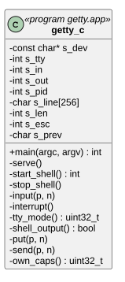
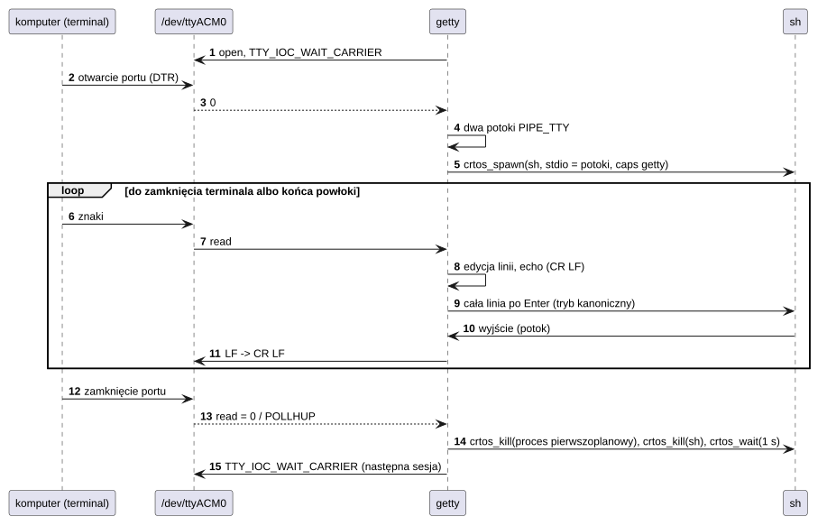

# U07 getty

## 1. Identyfikacja

| | |
|---|---|
| Identyfikator | U07 |
| Warstwa | L2 (usługa, uprawnienia `all` – przekazywane powłoce) |
| Pliki | `system/services/getty/getty.c` |
| Urządzenie | `/dev/ttyACM0` (D06, port szeregowy USB na J9) |

## 2. Odpowiedzialność

- Czekanie, aż program terminala na komputerze otworzy port (DTR,
  `TTY_IOC_WAIT_CARRIER`).
- Uruchomienie powłoki `sh` na dwóch potokach terminalowych (`PIPE_TTY`, K12) –
  tak jak terminal graficzny `term`.
- Edycja linii w trybie kanonicznym (echo, Backspace, Ctrl-U, pomijanie sekwencji ESC),
  surowy tryb bez edycji (tryb ustawia program przez potok – tak robi powłoka na czas
  edycji wiersza poleceń, A03); w trybie kanonicznym Ctrl-C przerywa proces pierwszoplanowy,
  w surowym idzie do programu jak każdy znak; końce linii CR LF.
- Koniec powłoki przy zamknięciu terminala; nowa powłoka, gdy poprzednia się zakończy,
  a terminal jest otwarty.

## 3. Wymagania

| ID | Wymaganie | Weryfikacja |
|---|---|---|
| REQ-U07-01 | Powłoka startuje dopiero, gdy terminal na komputerze otworzy port, i kończy się, gdy go zamknie. | test z komputerem (27.09.2026) |
| REQ-U07-02 | Powłoka dostaje uprawnienia `getty` (z `init.cfg`). | przegląd kodu |
| REQ-U07-03 | Brak urządzenia (port USB w trybie host, sterownik się ładuje) nie kończy usługi: ponowna próba co 5 s. | przegląd kodu |
| REQ-U07-04 | W trybie surowym każdy bajt, także Ctrl-C (3), trafia bez zmian do programu; tylko w trybie kanonicznym Ctrl-C kończy proces pierwszoplanowy albo daje nowy znak zachęty. | test przez COM6 (30.09.2026): Ctrl-C w edytorze wiersza powłoki porzuca wiersz, nie wykonuje go |

## 4. Interfejs udostępniany

`getty [urządzenie]` (domyślnie `/dev/ttyACM0`). Dla użytkownika: powłoka na porcie
szeregowym USB ([Debugowanie](../../debugowanie.md#konsola-przez-usb-j9)).

## 5. Interfejsy wymagane

D06 (`/dev/ttyACM0`, `TTY_IOC_WAIT_CARRIER`), K12 (`crtos_pipe(PIPE_TTY)`, `poll`), K15
(polecenia terminala na potokach: tryb, proces pierwszoplanowy), L01 (`crtos_spawn`),
A03 (`sh`).

## 6. Struktura statyczna

*Źródło: [U07/struktura-statyczna.puml](../diagramy/U07/struktura-statyczna.puml)*

## 7. Zachowanie dynamiczne

*Źródło: [U07/sesja.puml](../diagramy/U07/sesja.puml)*

## 8. Implementacja

- Jedna pętla `poll` na linii i wyjściu powłoki; wyjście powłoki czytane bez blokowania
  (`O_NONBLOCK`), `read` = 0 oznacza, że wszyscy piszący zamknęli potok (koniec powłoki).
- Powłoka dostaje uprawnienia `getty` (`own_caps()` z `crtos_proc_info`).
- Tryb (`TTY_IOC_GET_MODE`: kanoniczny, echo) jest czytany z potoku wejścia przed każdą
  porcją znaków, więc program może go zmienić w dowolnej chwili.
- Ctrl-C (tylko w trybie kanonicznym): `TTY_IOC_GET_FG` daje proces pierwszoplanowy
  (ustawia go powłoka), który dostaje `crtos_kill(fg, -EINTR)`; bez niego powłoka dostaje
  pusty wiersz (nowy znak zachęty). W trybie surowym Ctrl-C idzie do programu (edytor wiersza
  powłoki porzuca wtedy wiersz).
- Sekwencje ESC (`ESC [ ... litera`, np. strzałki) są w trybie kanonicznym pomijane.

## 9. Obsługa błędów i mechanizmy bezpieczeństwa

| Sytuacja | Reakcja |
|---|---|
| brak urządzenia | „waiting for /dev/ttyACM0”, próby co 5 s |
| powłoka nie startuje | komunikat, ponowienie po 5 s |
| powłoka się kończy | „the shell ended - a new one starts”, nowa po 0,5 s |

## 10. Konfiguracja

`SHELL` (`/sd/crtos/bin/sh.app`), `LINE_MAX` (256), `RETRY_MS` (5000); wpis
`service getty respawn caps=all ...` w `init.cfg`.

## 11. Weryfikacja

- Test z komputerem: port COM, powłoka, `uptime`, `cat`, Ctrl-C, Backspace, ok. 280 KB/s
  (27.09.2026).
- Edytor wiersza powłoki przez COM6 (30.09.2026, pyserial): pisanie, Ctrl-C porzuca wiersz,
  strzałka w górę przywołuje polecenie, strzałki w lewo i wstawianie w środku wiersza.

## 12. Ograniczenia i znane problemy

- Brak logowania: każdy, kto podłączy kabel USB do J9, dostaje powłokę z pełnymi
  uprawnieniami (płytka rozwojowa).
