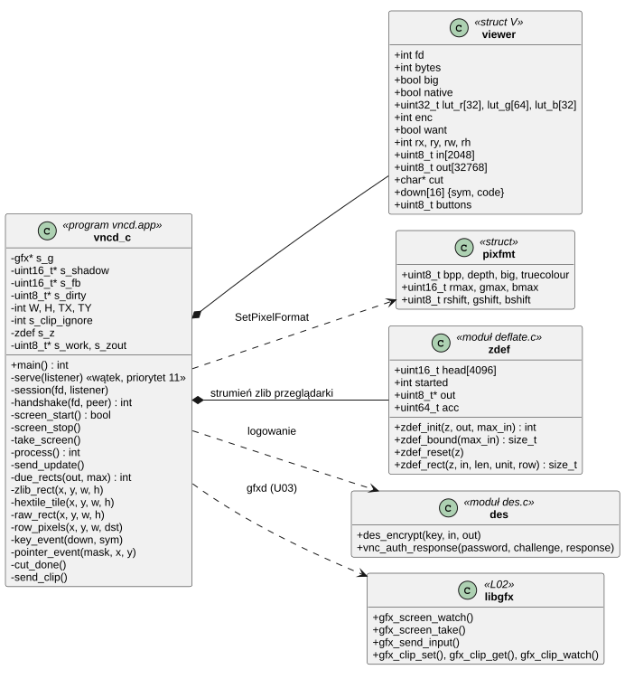
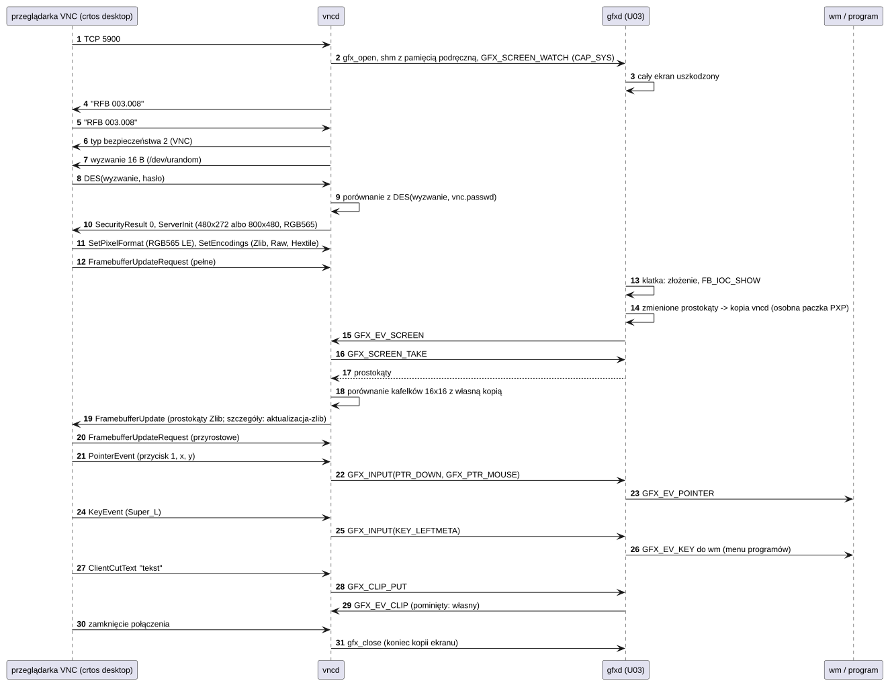
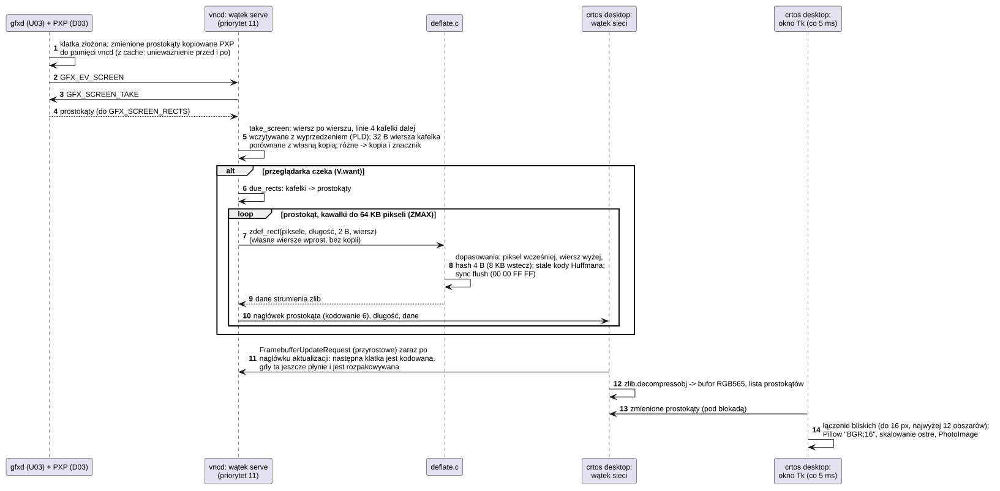

# U08 vncd: zdalny pulpit

## 1. Identyfikacja

| | |
|---|---|
| Identyfikator | U08 |
| Warstwa | L2 (usługa, uprawnienie `sys`) |
| Pliki | `system/services/vncd/vncd.c`, `system/services/vncd/deflate.c`, `deflate.h` (koder zlib), `system/services/vncd/des.c`, `des.h`; klient na komputerze: `tools/vnc.py` (`crtos desktop`, T01) |
| Port sieciowy | TCP 5900 (VNC, RFB 3.3/3.7/3.8, RFC 6143) |
| Konfiguracja | `/sd/crtos/etc/vnc.passwd` (hasło), wpis `service vncd respawn caps=sys` w `init.cfg` |

## 2. Odpowiedzialność

- Serwer VNC: ekran płytki dla przeglądarki VNC na komputerze (`crtos desktop` albo dowolna
  inna), uwierzytelnianie hasłem VNC, jedna przeglądarka naraz.
- Obraz: kopia ekranu od `gfxd` (U03, `GFX_SCREEN_WATCH`), własna kopia porównywana
  w kafelkach 16 × 16, wysyłanie tylko zmienionych kafelków, gdy przeglądarka prosi,
  w formacie pikseli, który wybrała (8, 16 albo 32 bity, dowolne przesunięcia i endianness;
  mapa kolorów 3-3-2), kodowaniem Zlib (własny koder deflate), Hextile albo Raw; przeglądarka
  w formacie ekranu (RGB565 little endian, `crtos desktop`) dostaje piksele bez przeliczania.
- Płynność: obsługa przeglądarki w wątku o priorytecie wyższym niż programy, zmiana interfejsu
  (okno, menu, animacja) w przeglądarce z częstotliwością odświeżania ekranu.
- Wejście: lewy przycisk myszy jako palec oznaczony `GFX_PTR_MOUSE`, ruch bez niego jako
  `GFX_PTR_HOVER` (podpowiedzi paska zadań), przyciski 4–7 jako
  kółka (`GFX_WHEEL`), klawisze X11 (keysym) jako kody klawiszy układu US (`GFX_KEY`),
  z dodaniem albo zdjęciem Shift wokół znaku, który tego wymaga.
- Schowek w obie strony: tekst przeglądarki (ClientCutText) do schowka `gfxd`, nowy tekst
  schowka `gfxd` do przeglądarki (ServerCutText), bez odsyłania przeglądarce jej własnego.

## 3. Wymagania

| ID | Wymaganie | Weryfikacja |
|---|---|---|
| REQ-U08-01 | Żadna przeglądarka nie dostaje obrazu ani nie wysyła wejścia bez poprawnej odpowiedzi na wyzwanie VNC (16 losowych bajtów z `/dev/urandom`, DES z hasłem z pierwszej linii `/sd/crtos/etc/vnc.passwd`, najwyżej 8 znaków); bez tego pliku (albo z pustym) każda jest odrzucana z powodem; porównanie odpowiedzi w czasie niezależnym od miejsca różnicy, 1 s kary za złe hasło. | DES: wektor FIPS 46 i OpenSSL (`des-ecb`), `crtos desktop` (poprawne hasło), przegląd kodu |
| REQ-U08-02 | Obraz wysyłany przeglądarce jest kopią ekranu: kafelek jest wysyłany, gdy różni się od stanu, który przeglądarka już ma; żądanie pełne (nie przyrostowe) wysyła cały żądany obszar; aktualizacja idzie tylko w odpowiedzi na żądanie. | `crtos desktop --shot` = `crtos shot` (30.09.2026: różnice tylko w miejscu poruszonego kursora myszy, poza tym ≤ 1 z rozwinięcia RGB565) |
| REQ-U08-03 | Piksele są kodowane w formacie przeglądarki (8/16/32 bity, `red/green/blue-max`, przesunięcia, big/little endian; przy mapie kolorów – stała paleta 3-3-2 wysłana `SetColourMapEntries`); kodowanie to pierwsze z listy przeglądarki spośród Zlib, Hextile i Raw (bez żadnego z nich – Raw); kafelek Hextile dłuższy niż surowy idzie jako surowy. | klient testowy RFB: Zlib, Hextile i Raw w 16 i 32 bitach = `crtos shot` (02.10.2026), przegląd kodu |
| REQ-U08-04 | Przycisk 1 myszy daje naciśnięcie, ruch i podniesienie palca 0 z `GFX_PTR_MOUSE` we współrzędnych przyciętych do ekranu, a ruch przy puszczonym przycisku 1 – `GFX_PTR_HOVER` (podpowiedzi); ruch jest wysyłany tylko przy zmianie pozycji; naciśnięcie przycisku 4/5 (6/7) daje jeden ząbek kółka pionowego (poziomego) w miejscu wskaźnika. | przegląd kodu, klient testowy RFB (`vnc_input`; `vnc_hover`: podpowiedź paska zadań po najechaniu, 30.09.2026) |
| REQ-U08-05 | Keysym znaku ASCII daje klawisz układu US, który go pisze; gdy znak wymaga Shift, a przeglądarka go nie trzyma, Shift jest naciskany na czas naciśnięcia klawisza, a gdy nie wymaga, a jest trzymany – zdejmowany; puszczenie keysym puszcza klawisz, który dla niego naciśnięto; ponowne naciśnięcie trzymanego keysym to powtórzenie (`value` 2). Klawisze specjalne (strzałki, F1–F12, Home…, Ctrl, Alt, Super) – z tabeli. | klient testowy RFB: Super_L otwiera menu `wm`, Esc je zamyka (30.09.2026) |
| REQ-U08-06 | Tekst przeglądarki (ClientCutText, do 64 KB, CR LF → LF) trafia do schowka `gfxd`, a każdy nowy tekst schowka od innego programu trafia do przeglądarki (ServerCutText); własny tekst przeglądarki nie wraca do niej. | klient testowy RFB + `cliptest` na płytce (30.09.2026: oba kierunki, bez echa) |
| REQ-U08-07 | Kopia ekranu, połączenie z `gfxd` i pamięć współdzielona istnieją tylko w czasie sesji: po rozłączeniu przeglądarki `vncd` zamyka połączenie z `gfxd` (kopia ekranu się kończy, U03), a nowa przeglądarka, która się zaloguje w czasie sesji, zastępuje poprzednią. | `kmon dmesg` (`gfxd: screen copy`, `vncd: connected/disconnected`), przegląd kodu |
| REQ-U08-08 | Kodowanie Zlib tworzy jeden strumień zlib (RFC 1950/1951) na połączenie, zaczynany od nowa dla każdej przeglądarki; każdy prostokąt to najwyżej `ZMAX` (64 KB) bajtów pikseli, a jego dane kończą się opróżnieniem strumienia (sync flush), więc przeglądarka rozpakowuje go w całości bez czekania na następny; dane wyjściowe prostokąta mieszczą się w `zdef_bound` (wejście + 1/8 + 64 B). | test na komputerze: `deflate.c` + `zlib` Pythona, obrazy pulpitu, gry i szumu, prostokąty jak na płytce – rozpakowane bajt w bajt (02.10.2026); klient testowy RFB = `crtos shot` |
| REQ-U08-09 | Przeglądarka w formacie ekranu (16 bitów, `red/green/blue-max` 31/63/31, przesunięcia 11/5/0, little endian) dostaje piksele kopii ekranu bez przeliczania: w Raw i w Zlib całe wiersze wprost z kopii. | klient testowy RFB (RGB565: Zlib, Raw = `crtos shot`), przegląd kodu |
| REQ-U08-10 | Przeglądarki obsługuje wątek o priorytecie 11 (wyżej niż programy, poniżej sterowników), który pracuje tylko wtedy, gdy ekran się zmienił, a przeglądarka czeka na aktualizację; zmiana małego obszaru ekranu (animacja, przesuwane okno) dochodzi do przeglądarki z częstotliwością odświeżania ekranu. | `vncbench` i `crtos desktop --stats` (02.10.2026: 59–60 aktualizacji/s przy animacji, 57–60 kl./s przy przesuwaniu okna 800×480) |

## 4. Interfejs udostępniany

Protokół RFB (RFC 6143) na TCP 5900:

| Etap / komunikat | Kierunek | Obsługa |
|---|---|---|
| wersja | oba | serwer 3.8; przeglądarka 3.3, 3.7 albo 3.8 |
| bezpieczeństwo | serwer → | tylko typ 2 (VNC Authentication); bez hasła na płytce: 0 typów i powód |
| ServerInit | serwer → | rozmiar ekranu (480 × 272 albo 800 × 480), RGB565 little endian, nazwa `CRTOS` |
| `SetPixelFormat` (0) | ← przeglądarka | format pikseli (cały ekran do wysłania na nowo) |
| `SetEncodings` (2) | ← przeglądarka | pierwsze z listy spośród Zlib (6), Hextile (5) i Raw (0); bez nich Raw |
| `FramebufferUpdateRequest` (3) | ← przeglądarka | obszar, przyrostowe albo pełne |
| `KeyEvent` (4) | ← przeglądarka | keysym, wciśnięty/puszczony |
| `PointerEvent` (5) | ← przeglądarka | maska przycisków 1–7, x, y |
| `ClientCutText` (6) | ← przeglądarka | tekst do schowka |
| `FramebufferUpdate` (0) | serwer → | prostokąty kafelków: Zlib (kawałki do 64 KB pikseli), Hextile albo Raw |
| `SetColourMapEntries` (1) | serwer → | paleta 3-3-2 (przeglądarka z mapą kolorów) |
| `ServerCutText` (3) | serwer → | tekst schowka płytki |

Nieznany komunikat przeglądarki kończy sesję (nie wiadomo, ile bajtów pominąć).

## 5. Interfejsy wymagane

U03 (przez L02: `gfx_open`, `gfx_screen_watch`, `gfx_screen_take`, `gfx_send_input`,
`gfx_clip_set/get/watch`, zdarzenia `GFX_EV_SCREEN`, `GFX_EV_CLIP`), D03 (PXP unieważnia
pamięć podręczną obszaru docelowego przed operacją i po niej: kopia ekranu może być w pamięci
z cache), K11 (pamięć współdzielona z pamięcią podręczną na obie kopie ekranu), K05
(`crtos_thread_start` z priorytetem 11), S05 (gniazda TCP,
`SO_RCVTIMEO`/`SO_SNDTIMEO`, `TCP_NODELAY`), K12 (`poll`), D08 (`/dev/urandom`), L01, L02
(`ui_char_key`: znak → klawisz).

## 6. Struktura statyczna

*Źródło: [U08/struktura-statyczna.puml](../diagramy/U08/struktura-statyczna.puml)*

## 7. Zachowanie dynamiczne

*Źródło: [U08/sesja.puml](../diagramy/U08/sesja.puml)*

*Źródło: [U08/aktualizacja-zlib.puml](../diagramy/U08/aktualizacja-zlib.puml)*

## 8. Implementacja

- Wątki: `main` otwiera gniazdo nasłuchujące i uruchamia wątek `serve` o priorytecie 11
  (stos 16 KB), który robi `accept` na porcie 5900, a potem pętlę sesji z `poll` na gnieździe
  przeglądarki, porcie zdarzeń `gfxd` i gnieździe nasłuchującym (1 s). Przy priorytecie
  programów (10) gra liczy bez przerwy i dzieliła z `vncd` procesor po kwantach 5 ms
  (aktualizacja czekała); wyżej `vncd` dostaje procesor zaraz, gdy ma pracę, i oddaje go,
  gdy czeka na sieć albo na `gfxd`. Nowa przeglądarka przechodzi całe logowanie (limity 10 s)
  i dopiero po nim zastępuje poprzednią.
- Obraz: dwa obiekty pamięci współdzielonej rozmiaru ekranu × 2 B z pamięcią podręczną (poza
  stertą: 750 KB każdy przy 800×480): kopia `gfxd` (pisze ją PXP, który unieważnia cache
  obszaru docelowego przed operacją i po niej, D03) i własna kopia – to, co przeglądarka ma
  albo zaraz dostanie. Kopia bez pamięci podręcznej kosztowała 121 ms na porównanie całego
  okna. `GFX_EV_SCREEN` → `gfx_screen_take` → `take_screen`: zmienione prostokąty wiersz po
  wierszu (obie kopie czytane po kolei), dla każdego kafelka 32 B wiersza porównane ośmioma
  słowami, linie 4 kafelki dalej zamawiane z wyprzedzeniem (`__builtin_prefetch`, PLD:
  chybienia SDRAM, ok. 350 ns każde, nie czekają po kolei); różny wiersz jest przepisany,
  a kafelek oznaczony. Pełne okno 800×480: ok. 9–12 ms.
- Aktualizacja: kafelki z żądanego obszaru łączone w prostokąty (odcinki wiersza kafelków,
  sklejane z odcinkiem tych samych kolumn wiersz niżej), do 512 prostokątów w jednym
  `FramebufferUpdate`; bufor wyjścia 32 KB wysyłany kawałkami (`TCP_NODELAY`).
- Zlib: prostokąt dzielony na kawałki całych wierszy do `ZMAX` (64 KB) pikseli; wiersze
  w formacie przeglądarki do bufora roboczego, a przy formacie ekranu i pełnej szerokości –
  wprost z własnej kopii. `deflate.c` (`zdef_rect`): jeden przebieg, dopasowania LZ77 od
  całego piksela i na całe piksele: piksel wcześniej (jednolity kolor, od 2 pikseli), wiersz
  wyżej i ostatnie miejsce z tymi samymi 4 bajtami (tablica 4096 pozycji `uint16_t` = 8 KB,
  kandydaci najwyżej 8 KB wstecz – zostają w D-cache; od 3 pikseli); najdłuższe wygrywa,
  bez leniwego dopasowania; kandydat najpierw porównywany 4 bajtami naraz. Stałe kody
  Huffmana (tablice odwróconych kodów liczone raz, długość z bitami dodatkowymi jednym
  wpisem), bity w 64-bitowym akumulatorze zapisywanym po 4 B; piksel bez dopasowania to dwa
  literały jednym zapisem. Pozycje z poprzednich prostokątów zostają w tablicy, a każdy
  kandydat jest sprawdzany bajt po bajcie na danych bieżącego prostokąta, więc dopasowanie
  jest zawsze prawdziwe. Koniec prostokąta: koniec bloku i pusty blok stored (00 00 FF FF).
  Nagłówek zlib (78 01) tylko w pierwszym prostokącie strumienia. Pulpit kurczy się do
  ok. 1,6%, obraz gry do ok. 12%, szum do 105% (`zdef_bound` z zapasem).
- Koszt pełnego okna 800×480 zmieniającego się w całości (gra): porównanie ok. 12,5 ms,
  kodowanie ok. 27 ms, wysyłanie ok. 13 ms (sieć ok. 5,4 MB/s).
- Hextile kafelka: do 16 kolorów liczonych w kafelku (więcej → surowy); tło = najczęstszy;
  jeden kolor → samo tło; dwa → prostokąty jednego koloru; więcej → prostokąty kolorowe
  (zachłanne: najdłuższy odcinek w prawo, potem w dół); tło i kolor pierwszego planu
  powtarzane między kafelkami prostokąta tylko wtedy, gdy są te same (po kafelku surowym –
  od nowa).
- Kolory: tablice `lut_r[32]`, `lut_g[64]`, `lut_b[32]` z formatu przeglądarki (zaokrąglone
  skalowanie składowych RGB565 do `max`, przesunięcie).
- DES: własna, prosta implementacja FIPS 46-3 (tablice permutacji, S-boksy, 16 rund); klucz
  VNC to hasło z odwróconą kolejnością bitów każdego bajtu.

## 9. Obsługa błędów i mechanizmy bezpieczeństwa

| Sytuacja | Reakcja |
|---|---|
| brak `/sd/crtos/etc/vnc.passwd` | przeglądarka odrzucona z powodem (`crtos desktop` instaluje hasło) |
| złe hasło | 1 s opóźnienia, SecurityResult „failed” (3.8: z powodem), rozłączenie |
| brak `gfxd` / odmowa kopii ekranu (brak `CAP_SYS`) | komunikat, połączenie zamknięte |
| nieznany komunikat przeglądarki, zerwane połączenie | koniec sesji, kopia ekranu zwolniona |
| przeglądarka nie odbiera (15 s) | błąd wysyłania, koniec sesji |
| przeglądarka wolniejsza niż zmiany ekranu | aktualizacja tylko na żądanie; zmiany zbierają się w znacznikach kafelków, a następna aktualizacja niesie stan bieżący (bez kolejki klatek) |
| dane nie do skompresowania (szum) | wynik do `zdef_bound` (wejście + 1/8 + 64 B), bufor wyjścia ma ten rozmiar |
| brak pamięci na bufory Zlib albo kopie ekranu | komunikat, połączenie zamknięte |
| zbyt długi tekst schowka przeglądarki | pierwsze 64 KB, reszta odebrana i pominięta |

## 10. Konfiguracja

`PORT` (5900), `PASSWD_FILE`, `TILE` (16), `OUT_SIZE` (32 KB), `IN_SIZE` (2 KB),
`ZMAX` (64 KB), `SERVE_PRIO` (11), `SERVE_STACK` (16 KB), `KEYS_DOWN` (16) w `vncd.c`;
`ZDEF_HASH_BITS` (12) w `deflate.h`, `MIN_MATCH` (4 B), `MIN_FAR` (6 B), `HASH_DIST` (8 KB)
w `deflate.c`; sterta 320 KB (bufory Zlib, schowek), stos 8 KB; uprawnienie `sys`
w `init.cfg`.

## 11. Weryfikacja

- DES (30.09.2026): wektor FIPS 46 (klucz `133457799BBCDFF1`, tekst `0123456789ABCDEF` →
  `85E813540F0AB405`) w C (MinGW) i w Pythonie; odpowiedź VNC dla hasła „secret” zgodna
  w C, Pythonie i z OpenSSL.
- `crtos desktop --shot` (pełna klatka w 0,1 s) porównany z `crtos shot`: różnice tylko
  w obszarze kursora myszy, który przesunął się między zrzutami.
- Klient testowy RFB: Super_L otwiera menu programów, Esc je zamyka; schowek w obie strony
  z `cliptest` na płytce.
- 02.10.2026, ekran 800×480: `crtos desktop --shot` daje 800×480, ten sam obraz co
  `crtos shot` (menu programów, terminal z klawiaturą).
- 02.10.2026, `deflate.c` na komputerze (MinGW) z `zlib` Pythona: pulpit, klatka gry i szum
  w prostokątach jak na płytce (8, 16 i 32 bity, prostokąty o wysokości 1–480 wierszy, kolejne jednym strumieniem) –
  rozpakowane bajt w bajt.
- 02.10.2026, klient testowy RFB: Zlib, Raw i Hextile w 16 i 32 bitach porównane z
  `crtos shot` – identyczne poza oknem `sysmon` (odświeża się co sekundę); na ekranie bez
  zmian wszystkie 6 kombinacji: 0 różnych pikseli.
- 02.10.2026, płynność (`vncbench`, `crtos desktop --stats`, 800×480): animacja `gfxdemo`
  59–60 aktualizacji/s (ok. 12 KB/s, opóźnienie mediana 16,9 ms); przesuwanie okna 57–60 kl./s;
  `gfxdemo` na cały ekran 23 kl./s (na samej płytce 29); gra 3D (`voxel`) 10 kl./s, tyle ile
  sama gra w tym czasie (wcześniej Hextile 32 bity: 3,7 aktualizacji/s, 266 ms opóźnienia).

## 12. Ograniczenia i znane problemy

- Uwierzytelnianie VNC jest słabe: DES z 8-znakowym hasłem, a przebieg wyzwanie–odpowiedź
  podsłuchany w sieci pozwala zgadywać hasło poza płytką; obraz i klawisze idą bez
  szyfrowania. Kto zna hasło, ma pulpit z terminalem (pełne uprawnienia powłoki okna). Tak jak
  `deployd` (U06) to narzędzie na zaufaną sieć; w produkcie – usunąć z `init.cfg`.
- Zlib ze stałymi kodami Huffmana (bez dynamicznych): obraz gry kurczy się do ok. 12%,
  a nie do kilku procent jak w zlib z najwyższym poziomem; ZRLE i Tight nie są obsługiwane.
- Obraz zmieniający się na całym ekranie 800×480 (gra) kosztuje ok. 50 ms pracy na klatkę
  (porównanie, kodowanie, wysyłanie): ok. 10 kl./s w przeglądarce, a `vncd` z priorytetem 11
  zabiera w tym czasie procesor programowi (`voxel`: z 29 do 10 kl./s, dopóki przeglądarka
  ogląda). Płynność 60 kl./s dotyczy zmian interfejsu, nie obrazu całego ekranu.
- Kursor myszy płytki (okno `inputd`) jest w obrazie tylko wtedy, gdy podłączona jest mysz
  USB; przeglądarka pokazuje swój.
- Prawy i środkowy przycisk myszy nie mają odpowiednika na płytce.
- Znaki spoza ASCII (np. polskie litery z AltGr) nie są przekazywane.
